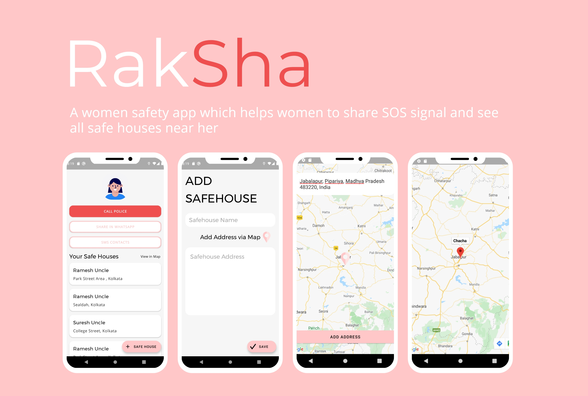
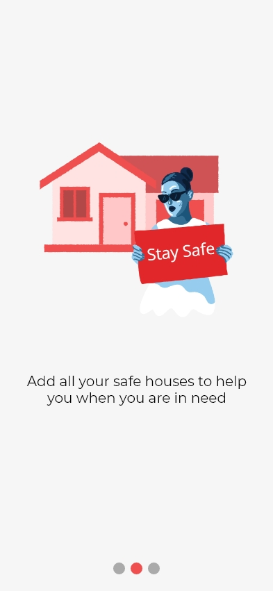
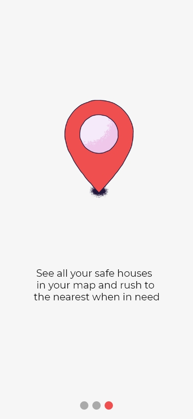
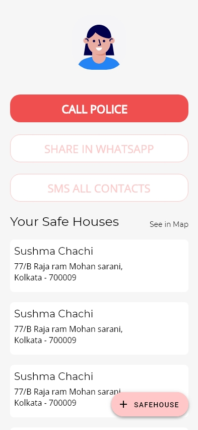

<h1 align="center">Hack36 Template Readme</h1>

## Introduction:
  

# **Raksha** 

**Raksha** is app in which users can see the address of the place or people he/she add so that in case of emergency he/she can contact the place or people or stay there. This app demonstrates use of *Modern Android development* tools.

## About

 It uses ROOM database i.e. Phone storage as its backend. The main aim to use the phone storage is **Your data is completely safe in your phone**
 
- Fully functionable. 
- Clean and Simple Material UI.
  
## Demo Video Link:
  <a href="https://youtu.be/980R-vV2Inw">https://youtu.be/980R-vV2Inw</a>
  
## Presentation Link:
  <a href="https://drive.google.com/file/d/16ShbmKR2qtuOxGKXALuHbBSbqz869aZA/view?usp=sharing"> https://drive.google.com/file/d/16ShbmKR2qtuOxGKXALuHbBSbqz869aZA/view?usp=sharing </a>
  
  
## Table of Contents:

## 📸 Screenshots

 ||||
 |:----------------------------------------:|:-----------------------------------------:|:-----------------------------------------: |
 |  |  |  |
 |  |  | 

 ## Built With 🛠
 - [Kotlin](https://kotlinlang.org/) - First class and official programming language for Android development.
 - [Coroutines](https://kotlinlang.org/docs/reference/coroutines-overview.html) - For asynchronous and more..
 - [Android Architecture Components](https://developer.android.com/topic/libraries/architecture) - Collection of libraries that help you design robust, testable, and maintainable apps.
   - [LiveData](https://developer.android.com/topic/libraries/architecture/livedata) - Data objects that notify views when the underlying database changes.
   - [ViewModel](https://developer.android.com/topic/libraries/architecture/viewmodel) - Stores UI-related data that isn't destroyed on UI changes. 
   - [ViewBinding](https://developer.android.com/topic/libraries/view-binding) - Generates a binding class for each XML layout file present in that module and allows you to more easily write code that interacts with views.
   - [DataBinding](https://developer.android.com/topic/libraries/data-binding) - Binds data directly into XML layouts
 - [Dependency Injection](https://developer.android.com/training/dependency-injection) - 
   - [Hilt-Dagger](https://dagger.dev/hilt/) - Standard library to incorporate Dagger dependency injection into an Android application.
   - [Hilt-ViewModel](https://developer.android.com/training/dependency-injection/hilt-jetpack) - DI for injecting `ViewModel`.
 - [Backend](https://https://developer.android.com/reference/android/arch/persistence/room/RoomDatabase) - Room Database for Android
 - [Google Maps](https://developers.google.com/maps/documentation) - To render google maps in app
 - [Timber](https://github.com/JakeWharton/timber) - A simple logging library for android.
 - [Material Components for Android](https://github.com/material-components/material-components-android) - Modular and customizable Material Design UI components for Android.

 # Package Structure

     com.vaibhav.sociofy    # Root Package
     .
     ├── data                # For data handling.
     │   ├── model           # Model data classes 
     │   └── repository      # Single source of data.
     |
     ├── di                  # Dependency Injection             
     │   └── module          # DI Modules
     |
     ├── ui                  # UI/View layer
     │   ├── homescreen      # Home Activity and its fragments
     |   ├── onboarding      # Onboarding Activity and its files
     │   └── splashScreen    # SplashScreen Activity
     |
     └── utils               # Utility Classes / Kotlin extensions

 ## Architecture
 This app uses [***MVVM (Model View View-Model)***](https://developer.android.com/jetpack/docs/guide#recommended-app-arch) architecture.

 

  ## Contact
 If you need any help, you can connect with me.

 Visit:- [Nishant Sharma](https://nishantsharma1115.github.io) | [Vaibhav Jaiswal](https://vaibhav2002.github.io)

## Technology Stack:
  1) Kotlin
  2) XML
  3) Adobe XD
  

## Contributors:

Team Name: BaldEagles

* [Nishant Sharma](https://github.com/nishantsharma1115)
* [Vaibhav Jaiswal](https://github.com/Vaibhav2002)
* [Sagar Khurana](https://github.com/hellosagar)

### Made at:

